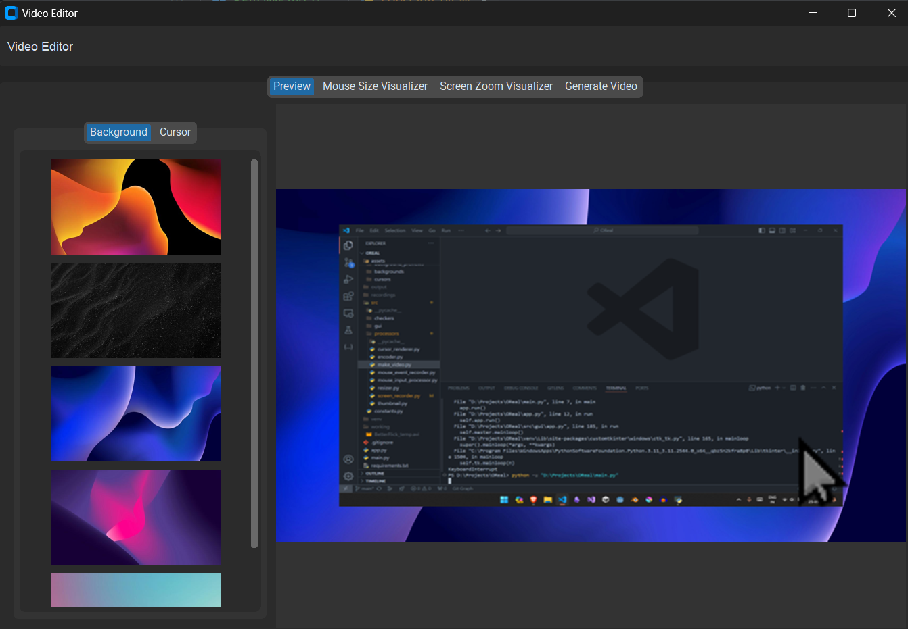
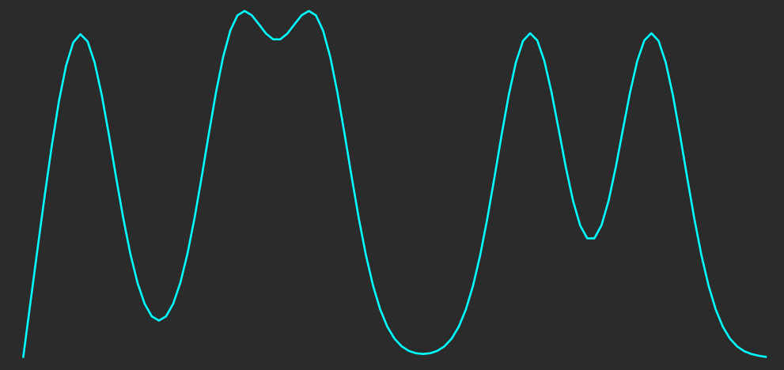
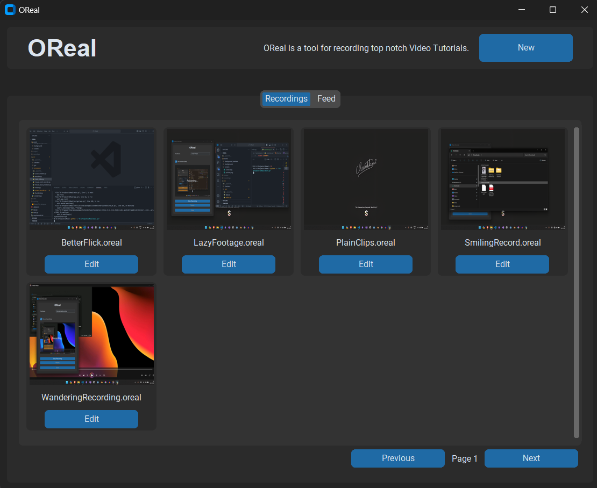
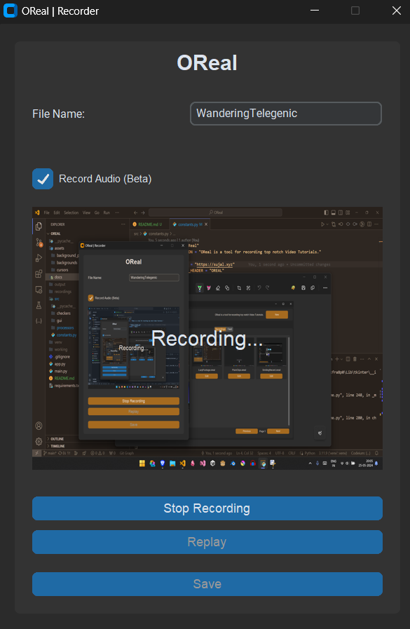

# OReal

## Description
**OReal** is a powerful tool designed for recording top-notch video tutorials. It allows users to automatically zoom into their videos, modify cursors, and customize backgrounds, enhancing the overall tutorial experience.

## Features
- Automatic zooming into videos
- Customizable cursors
- Background modifications
- Easy-to-use recording and editing interface

## Installation
1. Clone the repository:
    ```sh
    git clone https://github.com/SujalChoudhari/OReal.git
    ```
2. Navigate to the project directory:
    ```sh
    cd OReal
    ```
3. Install the required dependencies:
    ```sh
    pip install -r requirements.txt
    ```

## Usage

### Recording a Video
1. Launch the recorder GUI:
    ```sh
    python main.py
    ```
2. Enter the file name.
3. (Optional) Check the "Record Audio (Beta)" option if you want to record audio.
4. Click the "Record" button to start recording.
5. Click the "Stop Recording" button to stop recording.
6. Use the "Replay" button to preview the recording.
7. Click "Save" to save your recording.

### Screenshots

#### Editor
Edit the curves and backgrounds and cursors.


#### Curves
Smooth curves for zooming and scaling


#### Main
main user interface, users can record or edit videos


#### Recorder
Recorder to record videos along with audio


## Tech Stack
OReal is built using the following technologies and libraries:

- Python
- OpenCV (`opencv-python`)
- MoviePy (`moviepy`)
- Matplotlib (`matplotlib`)
- NumPy (`numpy`)
- Pandas (`pandas`)
- SciPy (`scipy`)
- CustomTkinter (`customtkinter`)
- PyAutoGUI (`PyAutoGUI`)
- Requests (`requests`)
- PyWebview (`pywebview`)
- PyAudio (`PyAudio`)
- Pynput (`pynput`)
- Pillow (`pillow`)

For a complete list of dependencies, see the `requirements.txt` file.

## Contributing
1. Fork the repository.
2. Create a new branch: `git checkout -b feature-branch`
3. Make your changes and commit them: `git commit -m 'Add some feature'`
4. Push to the branch: `git push origin feature-branch`
5. Open a pull request.

## Future Plans
- Smooth out the zooming and scaling.
- Modify the zoom and scale calculators.
- Speed up by multithreading.
- Move video generation part to a new thread.

## License
This project is licensed under the MIT License - see the [LICENSE](LICENSE) file for details.

## Acknowledgements
- Inspired by the need for high-quality video tutorials.
- Special thanks to the contributors and the open-source community.

## Contact
For more information, visit the [project page](https://github.com/SujalChoudhari/OReal).
